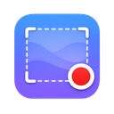

<div align="center">



# GIFrecorder

**Native macOS screen recorder. Export to GIF, MP4, or MOV — straight from your menu bar.**

[](https://www.apple.com/macos/)
[](https://support.apple.com/en-us/HT211814)
[](https://swift.org)
[](#license)

</div>

---

## Overview

GIFrecorder is a lightweight, native Apple Silicon app that lives in your menu bar. Draw a region, snap
to any open window, hit record — then export as an animated GIF, MP4, or MOV. No Electron, no bloat,
no subscriptions.

Built on **ScreenCaptureKit** for zero-copy screen capture and **AVAssetWriter** for H.264/AAC encoding,
it delivers crisp recordings with minimal CPU overhead.

---

## Features

### Capture
- **Region selection** — drag any rectangle on screen
- **Window snapping** — hover over an open window to auto-snap its bounds
- **Window tracking** — record moves and resizes with the window; pause or stop when it closes
- **3-second countdown** overlay before recording starts
- **Desktop audio** included in MP4 and MOV exports
- **Global hotkey ⌘⇧R** — start / stop from any app, no Accessibility permission required
- **Live file-size estimate** shown in the popover during recording

### Export
| Format | Audio | Notes |
|--------|-------|-------|
| **GIF** | — | High-quality via bundled [gifski](https://gif.ski); configurable fps, max width, max duration |
| **MP4** | ✓ | H.264 + AAC, hardware-accelerated |
| **MOV** | ✓ | QuickTime passthrough, same pipeline |

- **Trim UI** — drag range handles and preview before exporting
- **Export thumbnail** shown in the popover after every export
- **Copy to clipboard** automatically or on demand
- **Show in Finder** shortcut

### Settings
| Option | Default |
|--------|---------|
| Recording FPS | 30 |
| Default format | MP4 |
| Capture system audio | On |
| Show countdown | On |
| Global hotkey (⌘⇧R) | On |
| Auto-copy on export | Off |
| Show trim UI after recording | Off |
| Show Dock icon | Off |
| Window tracking | Off |
| On window close: pause / stop | Pause |
| GIF frame rate | 15 fps |
| GIF max width | 1280 px |
| GIF max duration | 30 s |
| Use gifski (higher quality) | On |

---

## Requirements

- **macOS 13.0 Ventura** or later
- **Apple Silicon (arm64)** — M1, M2, M3, M4 and all variants
- Screen Recording permission (prompted on first launch)

> Intel Macs are not supported. This is intentional — the app is built exclusively for arm64.

---

## Installation

### Download
Grab the latest `.app` from [Releases](../../releases) and drag it to `/Applications`.

### Build from source

**Prerequisites:**
```shell
# Xcode 16.3+ required (install from App Store or developer.apple.com)
brew install xcodegen swiftlint swift-format
```

```shell
# Clone
git clone https://github.com/jimicze/GIFrecorder.git
cd GIFrecorder

# Generate Xcode project
xcodegen generate

# Build Release
xcodebuild \
  -project GIFrecorder.xcodeproj \
  -scheme GIFrecorder \
  -configuration Release \
  -arch arm64 \
  -derivedDataPath DerivedData \
  build

# Launch (post-build script copies the signed .app here)
open build/Release/GIFrecorder.app
```

---

## Usage

1. **Click the menu bar icon** to open the popover
2. Click **Record** (or press **⌘⇧R** from any app)
3. **Drag** a rectangle — or **hover** over a window to snap to its bounds
   - To track window movement: hover over the window, wait for the **⊙ Track** badge, then click
4. Wait for the 3-second countdown, then recording begins
5. Click **Stop** in the popover (or press **⌘⇧R** again)
6. Optionally **trim** the clip with the range slider
7. Choose a format and save — a thumbnail appears in the popover

---

## Architecture

```text
Menu Bar (AppDelegate + NSStatusItem)
    └── SwiftUI Popover (MenuBarView)      ← state-driven via AppState.recordingState
            ├── [idle]     RecordingCoordinator.beginSelection()
            │       └── SelectionWindow (NSWindow, covers primary display)
            │               ├── SelectionView (mouse drag + window snap)
            │               └── WindowSnapManager (CGWindowList snap targets)
            ├── [countdown] CountdownWindow (3-2-1 NSWindow overlay)
            ├── [recording] RecordingCoordinator.stopRecording()
            │       ├── RecordingEngine  (SCStream → AVAssetWriter → temp .mov)
            │       ├── WindowTracker   (100ms poll, debounce, follow window)
            │       ├── NSSavePanel
            │       ├── TrimSheet       (SwiftUI + AVPlayer range slider)
            │       └── ExportManager
            │               ├── .mp4 → MP4Exporter (AVAssetExportSession)
            │               ├── .mov → MOVExporter
            │               └── .gif → GifskiExporter → fallback: GIFExporter
            └── Settings (SettingsView → AppSettings)

GlobalHotkeyManager (Carbon ⌘⇧R) → RecordingCoordinator via AppDelegate
```

**State machine:**
```text
.idle → .selectingRegion → .countdown(3→1) → .recording → .stopping → .exporting → .idle
```

**Module boundaries:**
- `Recording/` is headless — no UI imports; `RecordingEngine` is `@unchecked Sendable`
- `Export/` consumes a file URL — never a live stream; `ExportManager` is the only entry point
- `Models/` is pure data — no imports from other app modules

---

## Project Structure

```text
GIFrecorder/
├── GIFrecorder.xcodeproj/      # Generated — do not edit directly
├── project.yml                 # xcodegen source of truth for build settings
├── GIFrecorder/
│   ├── App/                    # AppDelegate, AppState, RecordingCoordinator, GlobalHotkeyManager
│   ├── UI/
│   │   ├── MenuBarView.swift   # Main popover UI
│   │   ├── SettingsView.swift  # All user-facing settings
│   │   ├── CountdownOverlay.swift
│   │   ├── TrimSheet.swift
│   │   └── SelectionOverlay/   # SelectionWindow, SelectionView, WindowSnapManager
│   ├── Recording/              # RecordingEngine, StreamDelegate, AssetWriterSession,
│   │                           #   WindowTracker, SegmentStitcher
│   ├── Export/                 # ExportManager, MP4/MOV/GIFExporter, GifskiExporter,
│   │                           #   ThumbnailGenerator
│   ├── Models/                 # AppSettings, ExportFormat, RecordingConfig, TrimRange
│   ├── Utilities/              # FileLogger (flog() global → ~/Library/Logs/…)
│   └── Resources/
│       └── Tools/gifski        # Bundled gifski binary (v1.34.0, arm64)
├── GIFrecorderTests/           # XCTest unit tests (53 tests, all passing)
└── build/
    └── Release/GIFrecorder.app # Post-build destination — always test from here
```

---

## Tech Stack

| Layer | Technology |
|-------|-----------|
| Language | Swift 5.9+ |
| UI | SwiftUI + AppKit |
| Screen capture | ScreenCaptureKit (`SCStream`) |
| Audio capture | ScreenCaptureKit (`capturesAudio`) |
| Video encoding | AVFoundation + VideoToolbox (H.264) |
| Audio encoding | AVFoundation (AAC) |
| GIF encoding | [gifski](https://gif.ski) (primary) + ImageIO (fallback) |
| Window enumeration | `CGWindowListCopyWindowInfo` + `SCShareableContent` |
| Global hotkey | Carbon `RegisterEventHotKey` |
| Project generation | [xcodegen](https://github.com/yonaskolb/XcodeGen) |

---

## Development

### Build

```shell
# Full clean Release build
xcodebuild \
  -project GIFrecorder.xcodeproj \
  -scheme GIFrecorder \
  -configuration Release \
  -arch arm64 \
  -derivedDataPath DerivedData \
  clean build

# Regenerate Xcode project after editing project.yml
xcodegen generate
```

### Test

```shell
xcodebuild test \
  -project GIFrecorder.xcodeproj \
  -scheme GIFrecorder \
  -destination 'platform=macOS,arch=arm64' \
  -derivedDataPath DerivedData
```

### Lint / Format

```shell
swiftlint lint --path GIFrecorder
swift-format format --in-place --recursive GIFrecorder/
```

### Diagnostics

```shell
# View persistent log
cat ~/Library/Logs/com.lasakondrej.gifrecorder/gifrecorder.log
```

---

## License

The GIFrecorder source code is released under the **MIT License** — see [LICENSE](LICENSE).

The bundled [`gifski`](https://gif.ski) binary (`GIFrecorder/Resources/Tools/gifski`) is licensed under
**AGPL-3.0** and is free for non-commercial use. Commercial use requires a separate license from
[Kornel Lesiński](https://github.com/ImageOptim/gifski).

---

<div align="center">
<sub>Built for Apple Silicon · No Electron · No subscriptions</sub>
</div>
