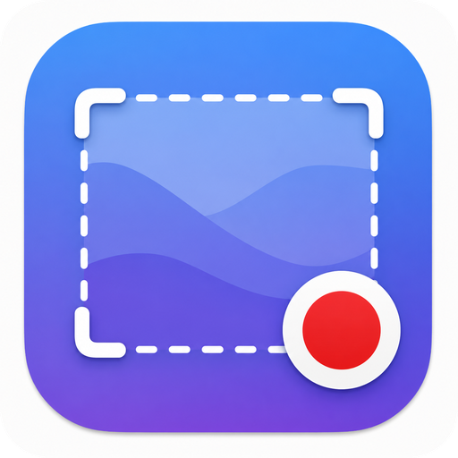

<div align="center">



# GIFrecorder

**Native macOS screen recorder. Export to GIF, MP4, or MOV — straight from your menu bar.**

[](https://www.apple.com/macos/)
[](https://support.apple.com/en-us/HT211814)
[](https://swift.org)
[](#license)

</div>

---

## Overview

GIFrecorder is a lightweight, native Apple Silicon app that lives in your menu bar. Draw a region, snap to any open window, hit record — then export as an animated GIF, MP4, or MOV. No Electron, no bloat, no subscriptions.

Built on **ScreenCaptureKit** for zero-copy screen capture and **AVAssetWriter** for H.264/AAC encoding, it delivers crisp recordings with minimal CPU overhead.

---

## Features

### Capture
- **Region selection** — drag any rectangle on screen
- **Window snapping** — hover over an open window to auto-snap its bounds
- **Live dimensions** displayed during selection
- **3-second countdown** overlay before recording starts
- **Desktop audio** included in MP4 and MOV exports

### Recording
- Configurable frame rate: **15 / 30 / 60 fps**
- **Live file-size estimate** shown in the menu bar popover during recording
- Stop via the popover or the global hotkey **⌘⇧R**
- Memory-safe streaming — frames are never buffered entirely in RAM

### Export
| Format | Audio | Notes |
|--------|-------|-------|
| **GIF** | — | Configurable fps, max width, max duration |
| **MP4** | ✓ | H.264 + AAC, hardware-accelerated |
| **MOV** | ✓ | QuickTime container, same pipeline |

- **Trim UI** — drag range handles and preview before exporting
- **Export thumbnail** shown in the popover after every export
- **Copy to clipboard** with one click
- **Show in Finder** shortcut

### Settings
| Option | Default |
|--------|---------|
| Recording FPS | 30 |
| Default format | MP4 |
| Capture system audio | On |
| Show countdown | On |
| Global hotkey (⌘⇧R) | On |
| Auto-copy on export | Off |
| Show trim UI after recording | Off |
| GIF frame rate | 15 fps |
| GIF max width | 1280 px |
| GIF max duration | 30 s |

---

## Requirements

- **macOS 13.0 Ventura** or later
- **Apple Silicon (arm64)** — M1, M2, M3, M4 and all variants
- Screen Recording permission (prompted on first launch)

> Intel Macs are not supported. This is intentional — the app is built exclusively for arm64.

---

## Installation

### Download
Grab the latest `.app` from [Releases](../../releases) and drag it to `/Applications`.

### Build from source
```bash
# Clone
git clone https://github.com/your-username/GIFrecorder.git
cd GIFrecorder

# Generate Xcode project (requires xcodegen)
xcodegen generate

# Build
xcodebuild -project GIFrecorder.xcodeproj \
           -scheme GIFrecorder \
           -configuration Release \
           -arch arm64 \
           -derivedDataPath DerivedData \
           build

# Open built app
open DerivedData/Build/Products/Release/GIFrecorder.app
```

**Dependencies:**
```bash
brew install xcodegen swiftlint swift-format
```

---

## Usage

1. **Click the menu bar icon** to open the popover
2. Click **Record** (or press **⌘⇧R** from any app)
3. **Drag** a rectangle or **hover** over a window to snap — click to confirm
4. Wait for the 3-second countdown, then recording begins
5. Click **Stop** in the popover (or press **⌘⇧R** again)
6. Optionally **trim** the clip with the range slider
7. Choose a format and save — a thumbnail appears in the popover

---

## Architecture

```
GIFrecorder/
├── App/                    # Entry point, AppDelegate, AppState, RecordingCoordinator
├── UI/                     # SwiftUI views — MenuBarView, SettingsView, TrimSheet,
│   └── SelectionOverlay/   #   SelectionWindow + SelectionView + WindowSnapManager
├── Recording/              # SCStream setup, StreamDelegate, AssetWriterSession
├── Export/                 # ExportManager → MP4Exporter / MOVExporter / GIFExporter
│   └── ThumbnailGenerator  #   Off-main-thread thumbnail extraction
└── Models/                 # AppSettings, ExportFormat, GIFExportOptions, TrimRange
```

**Key boundaries:**
- `Recording/` is headless — no UI imports
- `Export/` consumes a file URL — never a live stream
- `Models/` is pure data — no imports from other app modules

---

## Tech Stack

| Layer | Technology |
|-------|-----------|
| Language | Swift 5.9+ |
| UI | SwiftUI + AppKit |
| Screen capture | ScreenCaptureKit (`SCStream`) |
| Audio capture | ScreenCaptureKit (`capturesAudio`) |
| Video encoding | AVFoundation + VideoToolbox (H.264) |
| Audio encoding | AVFoundation (AAC) |
| GIF encoding | ImageIO + AVAssetImageGenerator |
| Window enumeration | `SCShareableContent` + Quartz |
| Global hotkey | Carbon `RegisterEventHotKey` |
| Package manager | Swift Package Manager |

---

## Development

```bash
# Run all tests
xcodebuild test \
  -project GIFrecorder.xcodeproj \
  -scheme GIFrecorder \
  -destination 'platform=macOS,arch=arm64' \
  -derivedDataPath DerivedData

# Lint
swiftlint lint --strict

# Format
swift-format format --in-place --recursive GIFrecorder/
```

---

## License

MIT — see [LICENSE](LICENSE).

---

<div align="center">
<sub>Built for Apple Silicon · No Electron · No subscriptions</sub>
</div>
